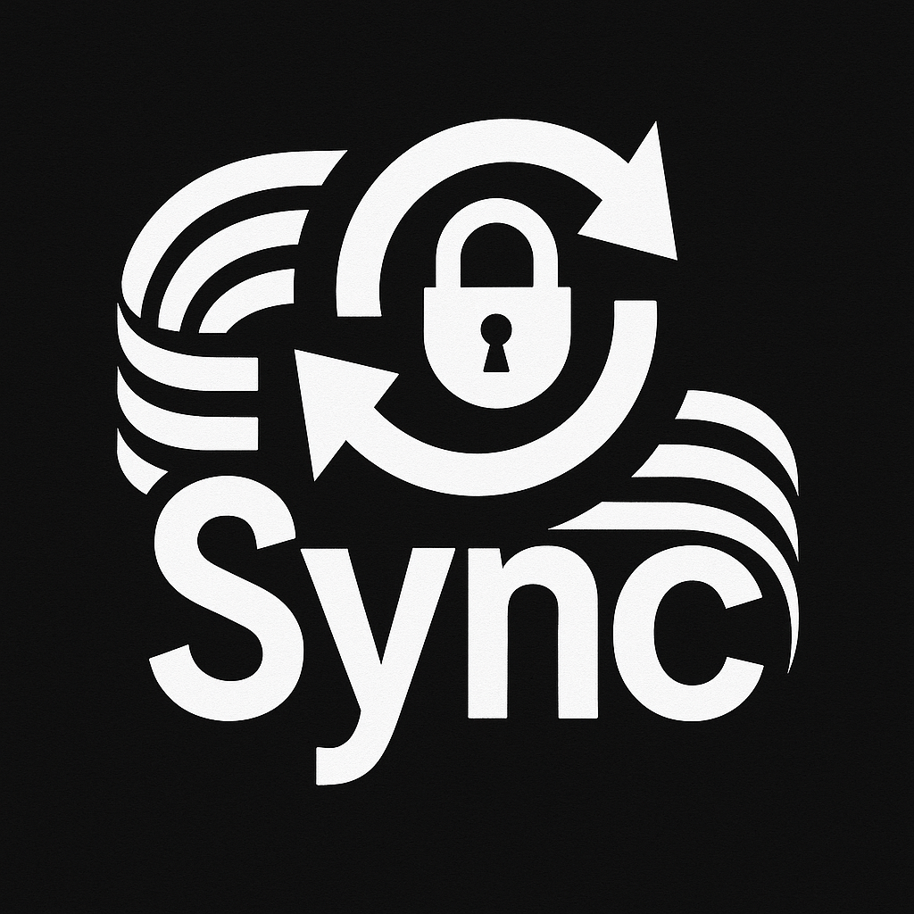

<p align="center">
    
</p>

<p align="center">
        <a href="https://packagist.org/packages/umar-jimoh/laravel-secretsync"></a>
        <a href="https://packagist.org/packages/umar-jimoh/laravel-secretsync"></a>
        <a href="https://packagist.org/packages/umar-jimoh/laravel-secretsync"></a>
        <a href="https://packagist.org/packages/umar-jimoh/laravel-secretsync"></a>
</p>

## Introduction

**Laravel SecretSync** allows you to seamlessly sync secrets from external secret managers directly into your Laravel application.

Supported providers:

- **Infisical**
- **Doppler** (new in **v1.2.0**)

Once installed, syncing secrets is as simple as:

```bash
php artisan secretsync
```

## 📦 Installation

Install via Composer:

```bash
composer require umar-jimoh/laravel-secretsync
```

Publish the configuration file:

```bash
php artisan vendor:publish --provider="UmarJimoh\SecretSync\SecretSyncServiceProvider" --tag=config
```

## 🧪 Usage

Before syncing, make sure your chosen secret manager is properly set up and your `.env` file contains the required credentials.

**Infisical Configuration**

```bash
SECRETSYNC_PROVIDER="infisical"
INFISICAL_API_ENDPOINT=
INFISICAL_TOKEN=
INFISICAL_ENV=
INFISICAL_WORK_ID="your-infisical-project-id"
```

**Doppler Configuration (new in v1.2.0)**

```bash
SECRETSYNC_PROVIDER="doppler"
DOPPLER_API_ENDPOINT=
DOPPLER_PROJECT=
DOPPLER_CONFIG=
```

> **Important:** Your `APP_KEY` must come from your secret manager.  
> Do **not** define `APP_KEY` in your `.env` file.

**Syncing Secrets**

```bash
php artisan secretsync
```

This command fetches and applies secrets from your configured provider.

## 🔒 Cache (Optional)

You can enable caching so secrets aren’t fetched on every sync:

```bash
SECRETSYNC_CACHE=true
SECRETSYNC_CACHE_TTL=300   # seconds
SECRETSYNC_CACHE_DRIVER=   # optional, defaults to Laravel's cache driver
```

Secrets stored in the cache are securely encrypted.

These settings can also be configured in `config/secretsync.php`.

## 🐞 Debugging

For detailed error output:

```bash
php artisan secretsync --debug
```

Or enable debugging in `.env`:

```bash
SECRETSYNC_DEBUG=true
```

## ⚠️ Production Note

After running:

```bash
php artisan optimize
```

or clearing config:

```bash
php artisan config:clear
```

You must run:

```bash
php artisan secretsync
```

to ensure all secrets are properly loaded.

## 🤝 Contributing

Please see the [CONTRIBUTING](https://github.com/Umar-Jimoh/laravel-secretsync/blob/HEAD/CONTRIBUTING.md) guide for details.

## 📧 Contact

If you have questions or suggestions, feel free to reach out:

- Email: [umarjimoh@hotmail.com](mailto:umarjimoh@hotmail.com)
- X\Twitter: [@umarjimoh_dev](https://x.com/umarjimoh_dev)

## 🔗 License

This package is open-source and licensed under the **[MIT License](https://github.com/Umar-Jimoh/laravel-secretsync/blob/HEAD/LICENSE)**.
